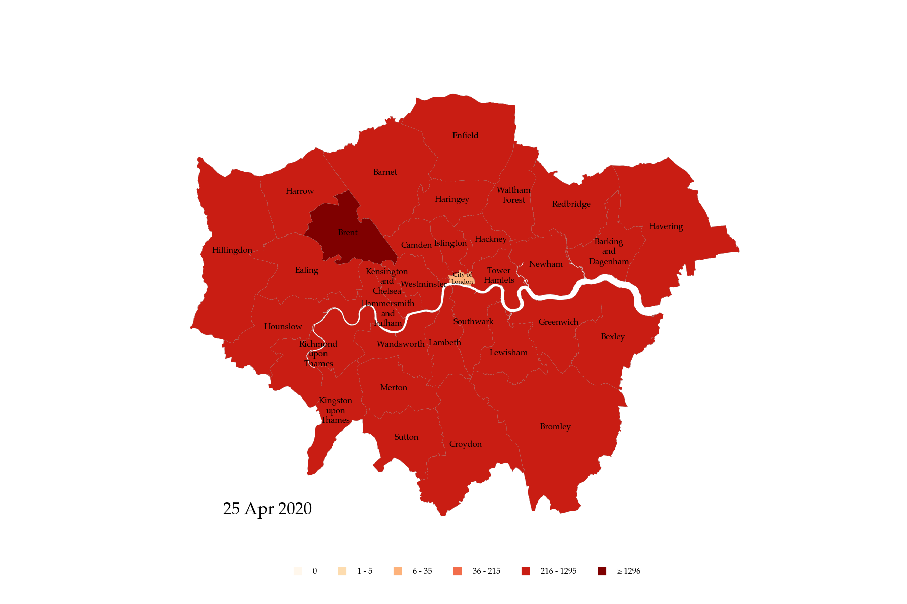

# COVID-19 UK Choropleth Map

## UK latest COVID-19 cases breakdown

## London latest COVID-19 cases breakdown

## Map notes

### Breakdown region level
* England: Ceremonial County (Data for Greater London and City of London are combined)
* Wales: Local Government
* Scotland: Health Board
* Northern Ireland: Country

## Data source

### Geometry
* UK: [Open Geography portal](http://geoportal.statistics.gov.uk)
* Ireland: [Ordnance Survey Ireland](https://data-osi.opendata.arcgis.com)

### Cases number
* England: [Coronavirus (COVID-19) cases in the UK](https://coronavirus.data.gov.uk)
* Scotland: [tomwhite/covid-19-uk-data](https://github.com/tomwhite/covid-19-uk-data), [Coronavirus (COVID-19) daily data for Scotland](https://www.gov.scot/publications/coronavirus-covid-19-daily-data-for-scotland/)
* Wales: [Rapid COVID-19 virology](https://public.tableau.com/profile/public.health.wales.health.protection#!/vizhome/RapidCOVID-19virology-Public/Headlinesummary)
* Northern Ireland: [tomwhite/covid-19-uk-data](https://github.com/tomwhite/covid-19-uk-data)